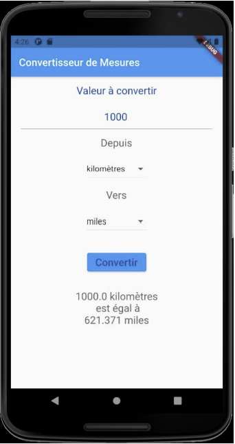

# [SCHOOL]

# Introduction to flutter, first tutorials

The aim of this class was to understand the basics concepts of __flutter__ as well as the __Dart__ programming language.

## 1. Measures converter

The measurement conversion app will allow users to select a measurement - metric or imperial - and convert it into another measurement. For example, they will be able to convert a distance in miles to a distance in kilometers or a weight in kilograms to a weight in pounds.

## 2. Work timer

This application helps set time intervals that suit you and measure your working and break time. This productivity app comes with a countdown timer that informs you of your remaining work or break time, complete with on-screen animation.

## 3. Pong game

This app is a simplified solo version of the classic game Pong. It uses flutter animations. It also detects gesstures to moove the plateform.

## 4. Films app

As soon as the user opens it, the application displays a list of movies about to be released in theaters. The user can also search for movies by title on the same screen. If they tap on one of the movies, the application will show a second screen, which provides a more detailed view of the movie, including a larger image and a preview. To retrieve the data, the application uses an open web service, which is the Movie Database API.

## 5. Event managers (firebase)

It's an event application where the user can view the schedule of an event, including calendar details. All data are hosted remotely, in a Firebase project. The events are stored in a Cloud Firestore database. Once authenticated using Firebase authentication, the user can select their favorite parts of the event by tapping on a star icon. This way, the "favorites" will also be stored remotely.

## 6. Treasure map (firebase)

The "Treasure Map" is an application that allows users, after being authenticated via "Firebase Authentication," to mark places on a map, and then add a name, address, and image to them. Photos are taken using the smartphone's camera. Users can view all the locations saved in the "Firebase Cloud" database and the photos in "Firebase Storage," marked on a map or through a list. They can also edit or delete them.

